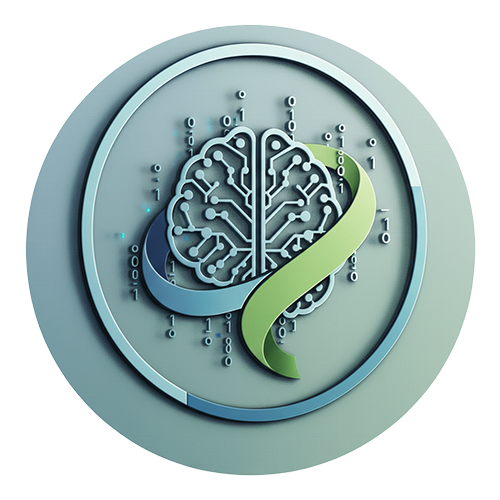
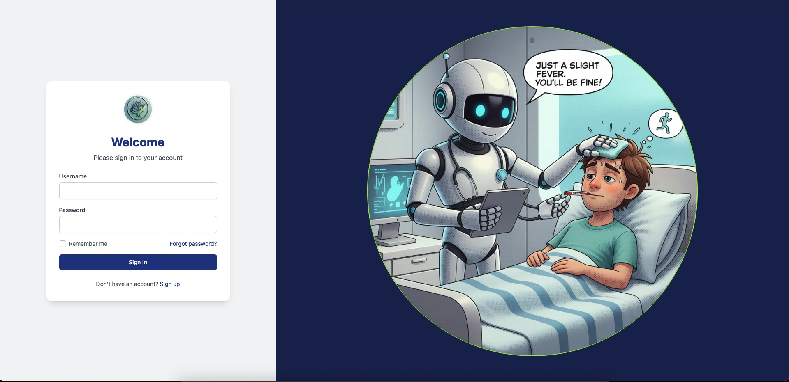
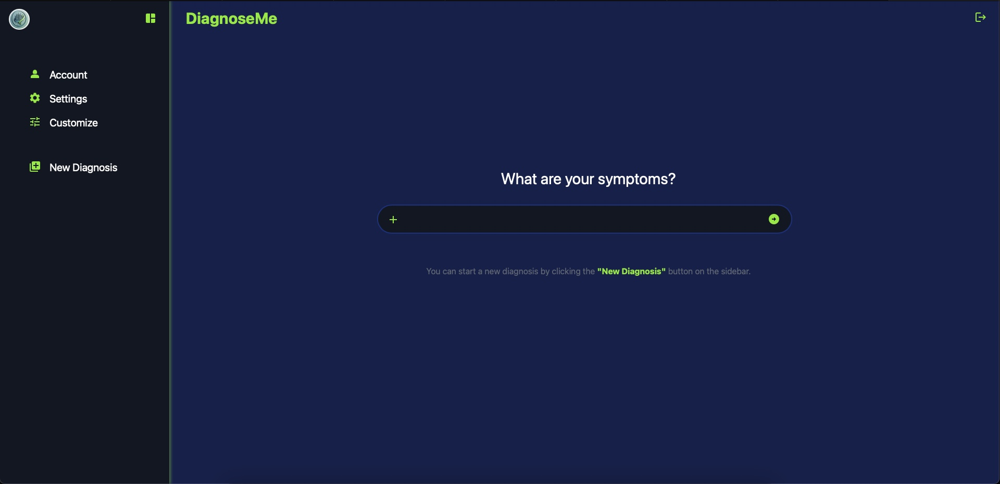

# 🤖 AI Symptom Analyzing Assistant



## About
AI Healthcare Assistant is a cutting-edge medical diagnostic tool that leverages artificial intelligence to provide preliminary health assessments. By combining advanced machine learning algorithms with user-friendly interfaces, it helps users understand potential health conditions based on their symptoms, bridging the gap between initial health concerns and professional medical consultation.

## ✨ Key Features
- 🔍 Intelligent symptom analysis
- 📊 Preliminary health assessments
- 💊 Medicine recommendations
- 💊 Medicine Information
- 🔐 Secure user authentication
- 📱 Responsive design

## 🛠 Tech Stack
- Frontend: React.js, Redux, TailwindCSS
- Backend: Node.js, Express
- Database: MongoDB
- Authentication: JWT
- AI Integration: OpenAI API

## 🚀 Getting Started

### Prerequisites
- Node.js (v14 or higher)
- npm or yarn
- MongoDB

### Installation
```bash
# Clone the repository
git clone https://github.com/Trevon-Woods-AI-Portfolio/ai-healthcare-assistant.git

# Install dependencies
cd ai-healthcare-assistant
npm install

# Set up environment variables
cp .env.example .env

# Start the development server
npm run dev
```

### 💻 Usage

- Register/Login to your account 
- Navigate to the diagnosis page
- Enter your symptoms
- Receive AI-powered health insights
- Track your health history





### 📝 API Documentation
Base URL: http://localhost:2828/api

** Endpoints **
- POST /api/user/register - User registration
- POST /api/user/login - User authentication
- POST /api/results/saveResult - Create new diagnosis
- GET /api/results/getResults - Get user's diagnosis history

### 🤝 Contributing
1. Fork the repository
2. Create your feature branch (git checkout -b feature/AmazingFeature)
3. Commit your changes (git commit -m 'Add some AmazingFeature')
4. Push to the branch (git push origin feature/AmazingFeature)
5. Open a Pull Request

### 📄 License
This project is licensed under the MIT License - see the LICENSE.md file for details.

### 👥 Authors
Trevon Woods - Initial work - [Trevon-Woods-AI-Portfolio](https://github.com/Trevon-Woods-AI-Portfolio)

### 🙏 Acknowledgments
- OpenAI for AI integration
- Medical professionals who provided guidance
- Contributors and testers
